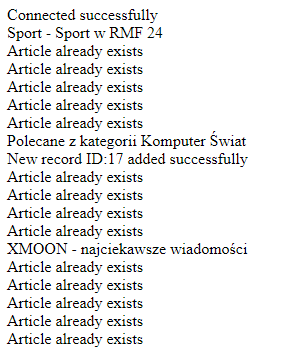
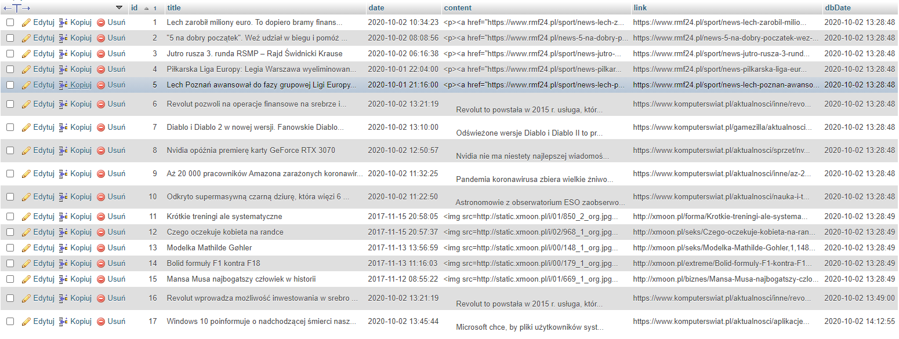

RSS reader 
===================================

RSS reader is a PHP script searching for articles in RSS-links and adding their content into MySQL database.

Features:
 - support for RSS links:
    * https://www.komputerswiat.pl/.feed
    * http://www.rmf24.pl/sport/feed
    * http://xmoon.pl/rss/rss.xml
 - Adding articles into database table named articles (id, title, date, content, link, dbDate)
 - Max 5 newest articles for single RSS
 - Checking if RSS responds and isn't empty
 - Logging into **src/logs.txt** file
 
# Visuals

---

# Installation

There are several ways to install RSS reader.

## Git:

 1. Clone the URL **https://github.com/klebann/RSS-reader.git** into any directory.
 2. import **src/articles.sql** database into new MySQL database named "rss" in phpMyAdmin.
 3. Edit the **src/config.php** file
 4. Upload files into your PHP server
 5. That's it!
 
## Archive download:

 1. Download the URL **https://github.com/klebann/test/archive/master.zip** into any directory.
 2. import **src/articles.sql** database into new MySQL database named "rss" in phpMyAdmin.
 3. Edit the **src/config.php** file
 4. Upload files into your PHP server
 5. That's it!

# Usage

To run RSS reader just run ./src/index.php in PHP-enabled web server.

It'll show there information about:
 - connection status
 - title of RSS
 - 5x article status (exist or added)

More logs are in **src/logs.txt.**
 - date and time the script started
 - date, time and id of added record
 - date and time the script ended

# Tested version and programs

SQL Server Version - 10.4.14-MariaDB

PHP Version - 7.2.33

XAMPP Control Panel - v3.2.4

XAMPP for Windows - 7.2.33

Apache Version - Apache/2.4.46

# Contributing

Pull requests are welcome. For major changes, please open an issue first to discuss what you would like to change.

Please make sure to update tests as appropriate.

# Author

[Jakub Kleban](https://github.com/klebann)

# License
[GPL](https://www.gnu.org/licenses/gpl-3.0.en.html)